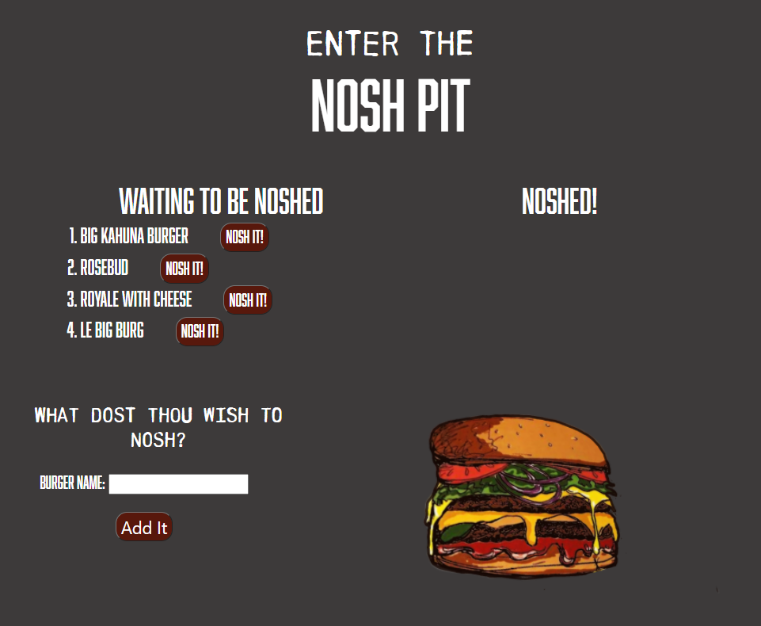

# hw13-nosh-pit


## Description:
For this assigment, I was instructed to create a "burger logger" using MySQL, Node, Express, and Handlebars. The purpose of this assigment was to follow the MVC design pattern.

When a user submits a burger's name, the app didsplays the burger on the left side of the page, waiting to be "noshed". There is a button to "nosh" and when the user hits said button, the burger is transfered to the right side of the page in the "noshed" area.


## Technologies :
* Javascript
* Node.js
* Express.js
* MySql
* Handlebars
``` javascript
<div class="row" id="left">
      <ol>
        {{#each burgers}}
        {{#unless noshed}}
        {{> burgers/burger-block noshed=true}}
        {{/unless}}
        {{/each}}
      </ol>
    </div>
```


####Deployed on: 
Heroku